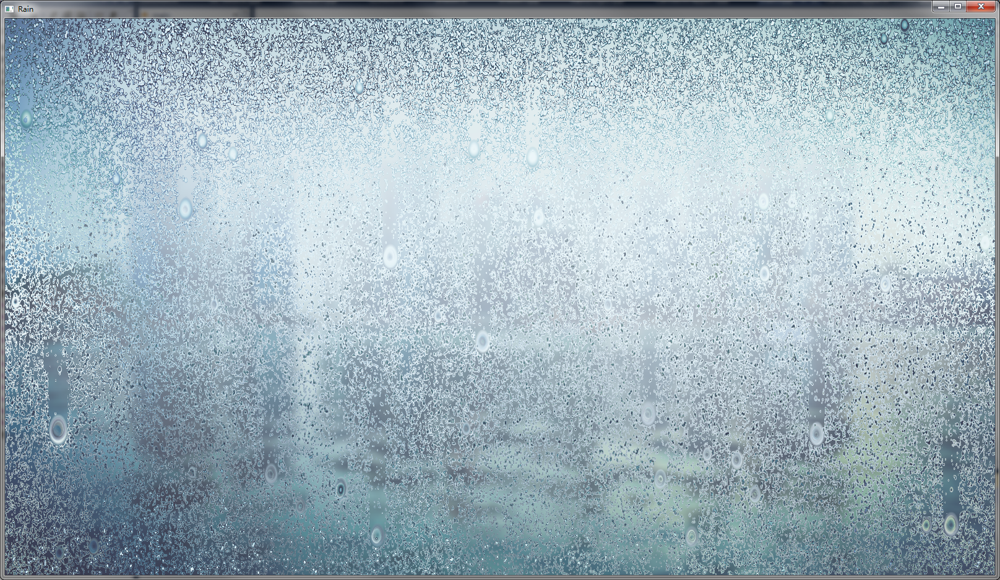

# Rain
This project reproduced the rainy effect of this [site](http://tympanus.net/codrops/2015/11/04/rain-water-effect-experiments/) using OpenGL. 

## Dependency
See the `./3rdparty` directory.
- freeglut
- GLEW
- OpenCV
- OpenGL
For Linux users, please link these library when make.

## Highlights
 - The OpenGL wrapper is upgraded to C++11. No bare pointer is used anymore.
 - A simple simulator for Canvas and 2D context in WebGL is implemented.

## Screen shot

## TODO
Try other rain simulation method.
